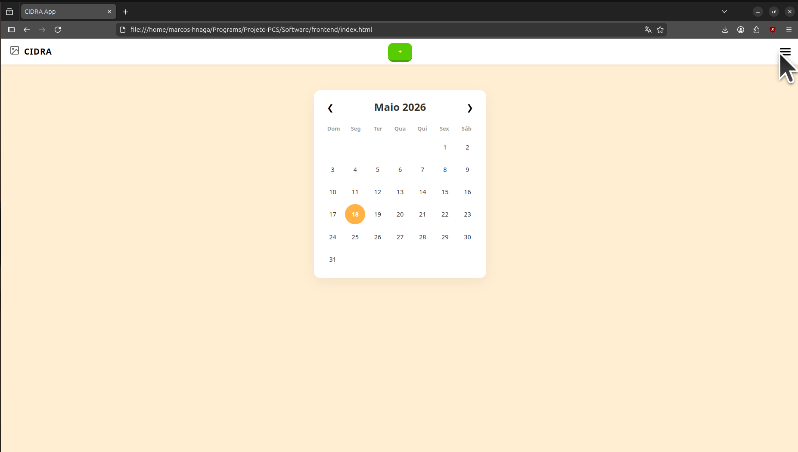
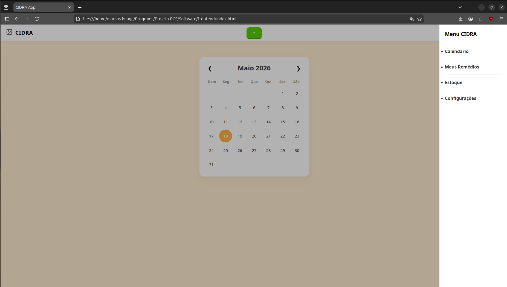

# Aplicativo CIDRA

## WebApp

Utilização do modelo de IA Gemini como ferramenta assistente de geração de código para a produção do App.
Aplicativo desenvolvido com a ideia de facilitar a vida do usuário quando ele vai planejar um tratamento com um medicamento.
Possui as seguintes funções:
1. [Calendário](./doc/calendario.md)
2. [Lista de Remédios](./doc/lista-remedios.md)
3. [Estoque de Medicamentos](./doc/estoque.md)
4. [Configurações de Sistema](./doc/configurações.md)

### Menu
Acesso das funções por meio do **Menu Hambúrguer** na lateral direita

### Notificações
O aplicativo tem as notificações que irão alertar o usuário sobre:
1. O horário de tomar remédio;

2. Quando o usuário perdeu o horário do medicamento;

3. A data de reestoque;

