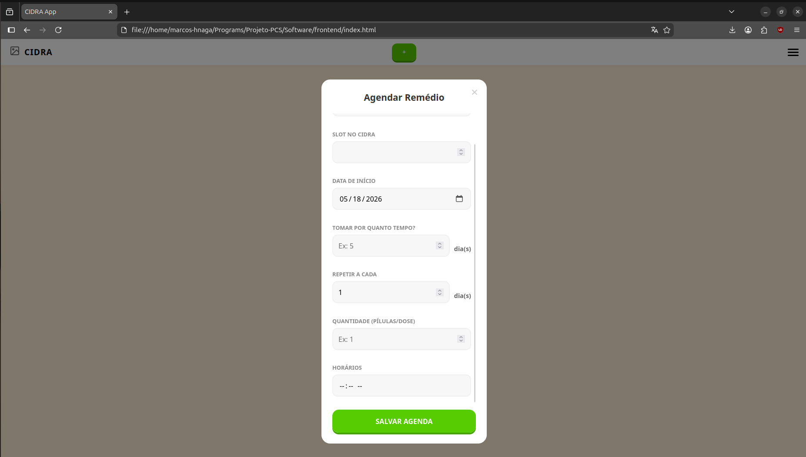
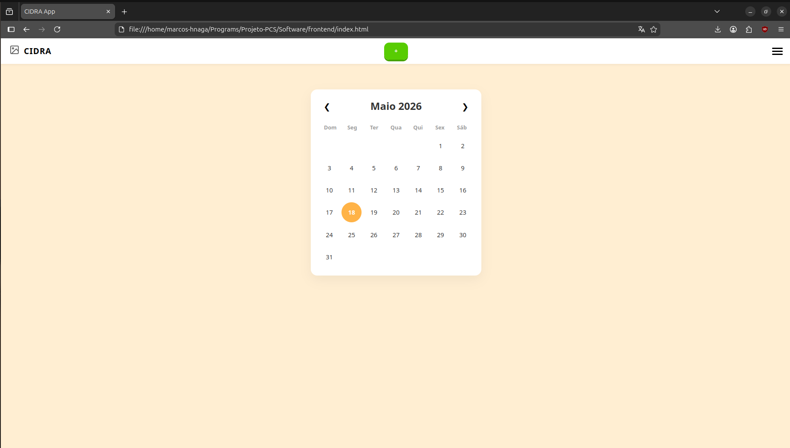
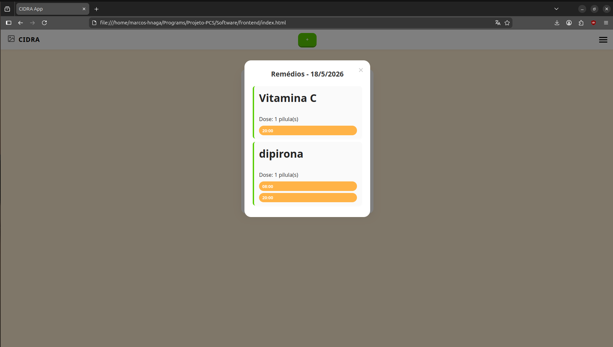

# Calendário

### Função principal do Aplicativo
O agendamento e a leitura de informações, via calendário, acerca de:
- Remédio a ser tomado;
- Slot de ocupação na CIDRA;
- Data de início de aplicação;
- Quantidade de dias até o fim do tratamento;
- Frequência da aplicação;
- Quantidade da dose;
- Horários de aplicação do medicamento

Obtidas por meio de um formulário preenchido após apertar o botão verde "Duolingo"

---

O calendário é o principal meio de interagir com as informações obtidas por meio do formulário, mostrando as datas e horários de aplicação e a data de reestoque de cada medicamento.
É um calendário interativo que busca facilitar do usuário obter informações que lhe convém.

