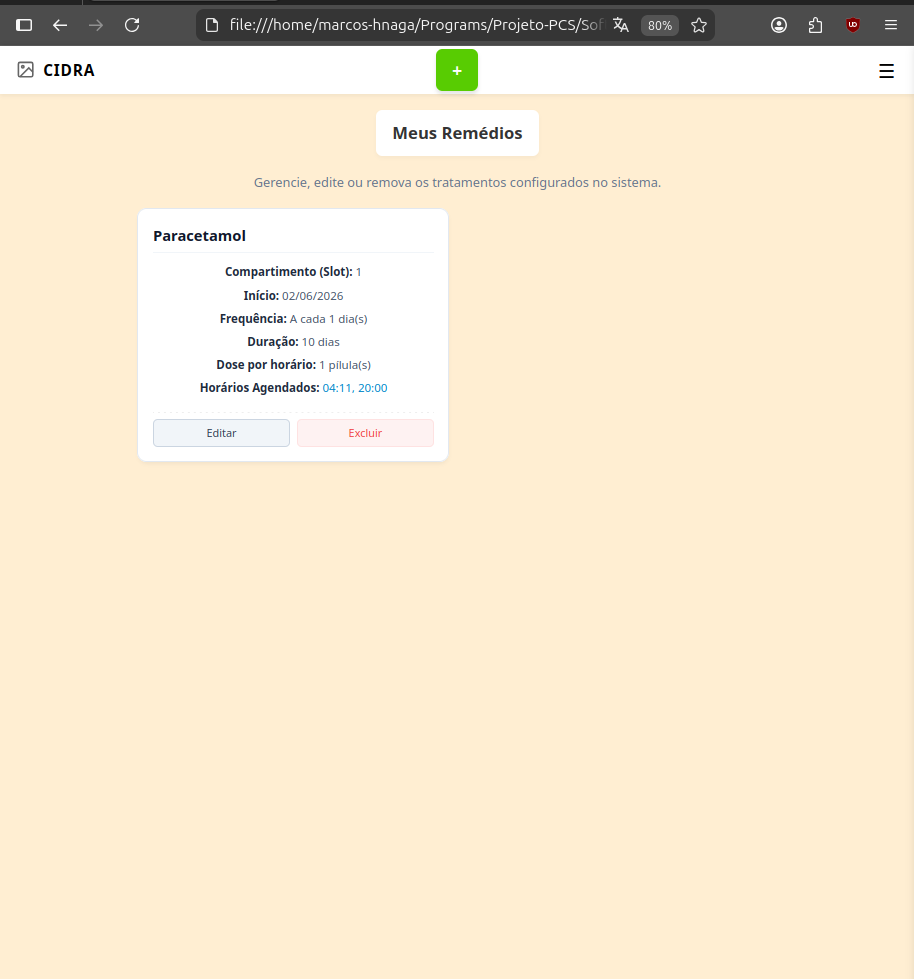
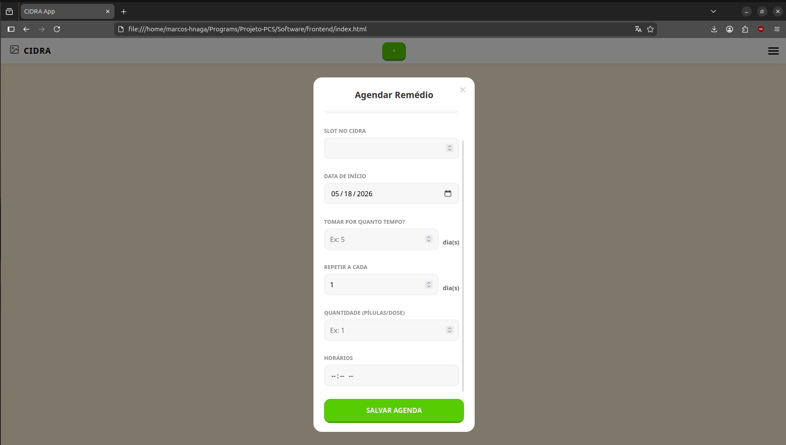
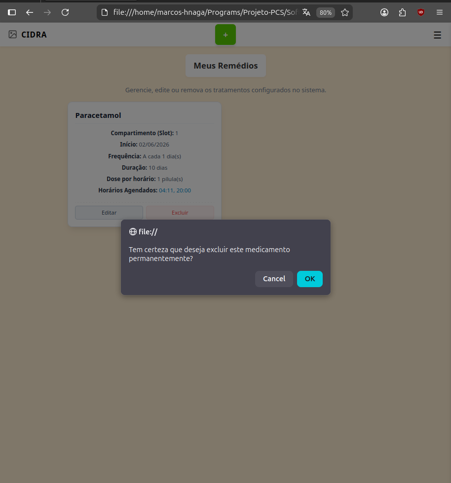

# Lista de Remédios

Local de visualisação da informação em formato não processado, com acesso direto à edição das informações de cada medicamento.

Há também a possibilidade de alterar as informações a partir dos botões de *Editar*, acessando o formulário

ou *Deletar*, que remove o medicamento do perfil do usuário.

